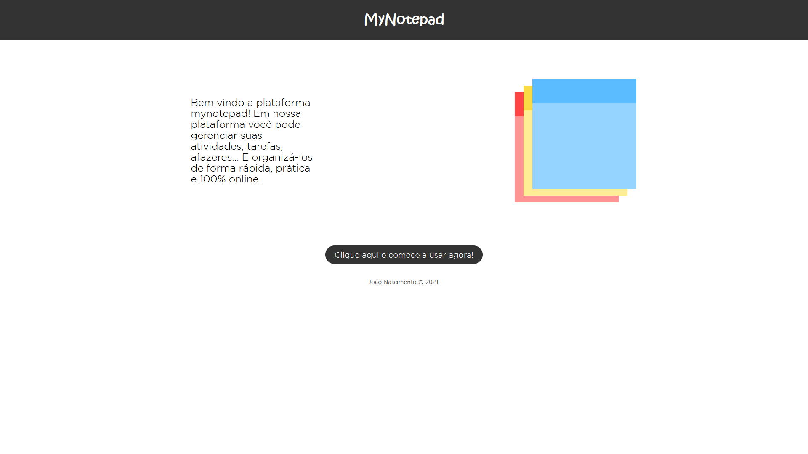

# MyNotepad.com
  
Um projeto feito para exercitar conceitos fundamentais de desenvolvimento backend, tais como:
 - Criação e consumo de APIs
 - CRUD
 - Controle de rotas
 - Autenticação por token
 - Cookies
 
 Desenvolvido em Node Js utilizando:
 - express 
 - mongoose/mongodb 
 - handlebars 
 - json web token 
 - bcrypt
  
## O que é o mynotepad?

O mynotepad é uma plataforma online feita para a criação e o gerenciamento de anotações.

