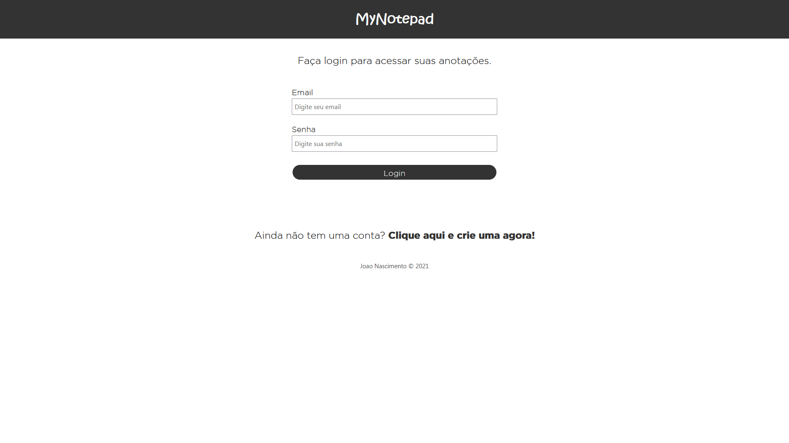
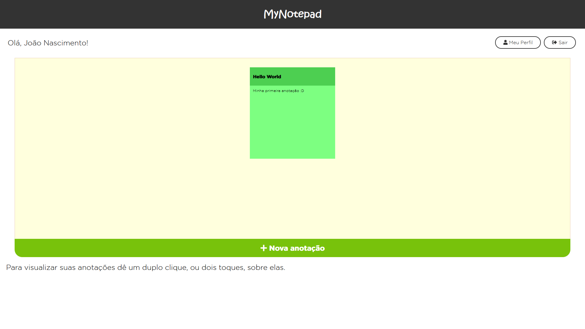

# MyNotepad.com
  
Um projeto feito para exercitar conceitos fundamentais de desenvolvimento backend, tais como:

 - Criação e consumo de APIs
 - CRUD
 - Controle de rotas
 - Autenticação por token
 - Cookies
 
 Desenvolvido em Node Js utilizando algumas das dependências mais famosas, como:
 
 - express 
 - mongoose/mongodb
 - handlebars 
 - json web token 
 - bcrypt
 - nodemon (durante o desenvolvimento)
  
## O que é o mynotepad?

O mynotepad é uma plataforma online feita para a criação e o gerenciamento de anotações.

## Como usar o mynotepad?

O mynotepad pode ser acessado através deste link: **https://mynotepad-production.herokuapp.com/**

----------------------------------------------------------------------------------------------------------------------------------------------------------------------

### Guia do usuário

#### Primeiros passos

Clicando em **"Clique aqui e comece a usar agora"**, na página principal, o usuário será redirecionado à página de login, na qual poderá iniciar sua sessão inserindo seus dados.

Caso ainda não tenha uma conta criada, basta que o usuário acesse o link abaixo da página de login. Ao clicar em **"Clique aqui e crie uma agora."** ele será automaticamente redirecionado para a página de cadastro.

#### Minhas primeiras anotações

Após concluir o seu login, ou cadastro, com sucesso, o usuário será redirecionado para o seu mural de anotações que, por sua vez, estará vazio inicialmente.

Para o usuário criar sua primeira anotação, basta clicar em **"Nova anotação"** e preencher os campos de acordo com as instruções do campo.

Tendo criado sua primeira anotação, o usuário será redirecionado para seu mural novamente, no qual poderá visualizar suas anotações criadas.

Caso queira editar, excluir ou apenas ver mais de perto suas anotações já criadas, o usuário pode simplesmente dar um duplo clique, ou toque (caso esteja usando um smartphone, ou algum outro dispositivo sensitível ao toque).

E pronto! A partir deste momento o usuário está apto a explorar o máximo da versão atual da plataforma.

#### Gerenciamento de dados do usuário

Os dados do usuário armazenados no sistema são usados apenas para identificação pessoal e segurança, e podem ser consultados a qualquer momento na página de **"Meu perfil"**. Caso o usuário ainda assim não se sinta à vontade, ele pode excluir sua conta a qualquer momento também na página do seu perfil.

Para segurança do usuário, ao excluir sua conta é requerida a senha para validação e prevenção de exclusão acidental.

**OBS:** Na versão atual do sistema ainda não é possível alterar os dados após o cadastro.
